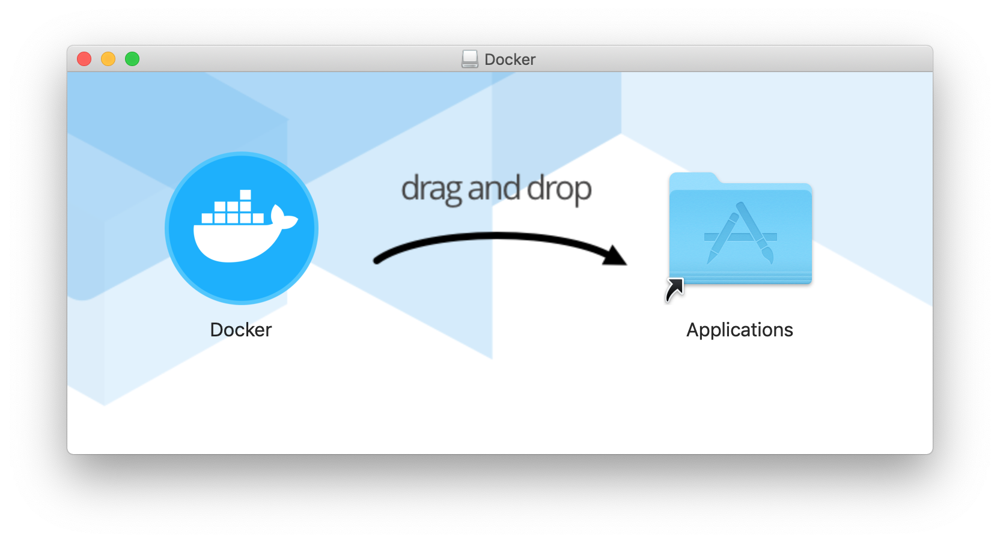
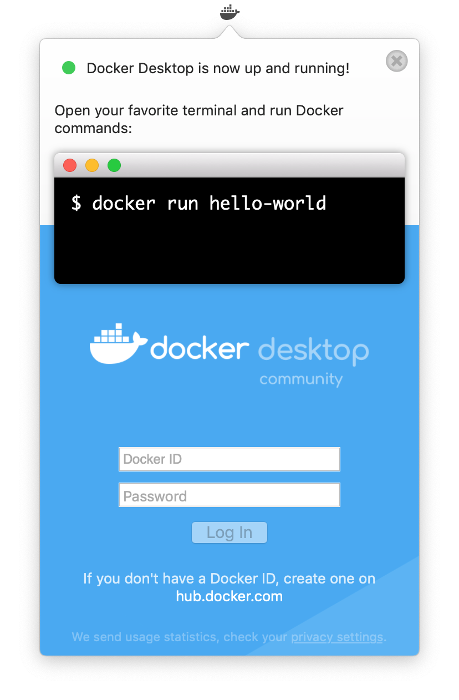

# User Guide

## Background

The Alaska Satellite Facility (ASF) has developed an advanced product toolbox (APT) capable of conducting Interferometric SAR Processing (InSAR) leveraging the ISCE Processor named apt-insar. The toolbox provides automated fetching of data from ASF's datapool (https://vertex.daac.asf.alaska.edu), Digital Elevation Map (DEM) selection and stitching, and bundles NASA's Jet Propultion Labritory (JPL) ISCE processor to produce interferogram products from start to finish. This allows users to begin with a pair of granule names and in one command produce an analysis ready interferogram.

Interferograms measure millimeter-scale changes in deformation over spans of days to years. Applications include:
* Measuring tectonic deformation due to earthquakes
* Deformation associated with volcanic eruptions
* Ground subsistence stemming from water or oil extraction from underground reservoirs
* Monitoring landscape features such as landslides, urban growth, or deforestation
* Measuring glacial motion and deformation

## Output Products
- GeoTIFF Unwrapped Phase image with 
- GeoTIFF Coherence image with
- GeoTIFF Amplitude image with

## System Requirements

* Operating System
    - macOS 10.11 or later 
    - Ubuntu 18.04 or later
    - CentOS 7 or later
* 64-bit installation
* 4 GB of RAM
* 100 GB of available hard disk space

## Installation

<details><summary>macOS</summary>

1. Download the [Docker for Mac](https://download.docker.com/mac/stable/Docker.dmg) installer (~500 MB).

1. Double-click Docker.dmg to open the installer, then drag Moby the whale to the Applications folder.

   <p align="center"></p>

1. Double-click Docker.app in the Applications folder to start Docker, then follow any installation prompts.  When complete, "Docker Desktop is now up and running!" should be displayed.

   **Note:** A Docker ID is not required.

   <p align="center"></p>
   
   <p align="center"></p>

1. Click the Docker icon in the top status bar and select "Preferences".

   <p align="center"></p>

   1. Select "Advanced".
   1. Set "CPUs" to 4 or higher. More CPUs means faster processing, but may leave fewer resources for other programs during processing.
   1. Set "Memory" to 16.0 GiB or higher.
   1. Click "Apply & Restart" and wait for the green "Docker Engine is running" message to reappear.
   
   <p align="center"></p>

1. Download [**apt-insar.sh**](https://asfdaac.s3.amazonaws.com/apt-insar.sh) to the directory where InSAR products should be saved.

</details>

<details><summary>Ubuntu 18.04</summary>

1. Install Docker using apt
   ```
   sudo apt update
   sudo apt install -y docker.io
   ```
1. Add your user to the docker group
   ```
   sudo usermod -aG docker $USER
   ```
1. Log out and log back in for the group change to take effect
1. To verify everything is working run the docker command
   ```
   docker run hello-world
   ```
   Confirm you see the following in your output
   ```
   Hello from Docker!
   This message shows that your installation appears to be working correctly.
   ```
1. Download **apt-insar.sh** to the directory where InSAR products should be saved
   ```
   wget https://raw.githubusercontent.com/asfadmin/grfn-s1tbx-rtc/master/scripts/apt-insar.sh
   ```
</details>

<details><summary>CentOS 7</summary>

1. Install Docker
   ```
   curl -fsSL https://get.docker.com/ | sh
   ```
1. Create a docker group and add your user to it
   ```
   sudo groupadd docker
   sudo usermod -aG docker $USER
   ```
1. Log out and log back in for the group change to take effect
1. Start Docker
   ```
   sudo service docker start
   ```
1. To verify everything is working run the docker command
   ```
   docker run hello-world
   ```
   Confirm you see the following in your output
   ```
   Hello from Docker!
   This message shows that your installation appears to be working correctly.
   ```
1. Download **apt-insar** to the directory where InSAR products should be saved
   ```
   wget https://raw.githubusercontent.com/asfadmin/grfn-s1tbx-rtc/master/scripts/apt-insar.sh
   ```
</details>

## Usage

1. Find the name of the SLC granules to process from [Vertex](https://vertex.daac.asf.alaska.edu/).
   
   *The examples below use S1A_IW_SLC__1SDV_20190518T161611_20190518T161638_027284_0313A1_AE8A and S1A_IW_SLC__1SDV_20190506T161610_20190506T161637_027109_030E29_5A71*.

1. **macOS only**

   1. Open the Terminal app

      <p align="center"></p>
   
   1. In your Terminal window, navigate to the directory where **apt-insar.sh** is saved.
   
      *For example, if you saved the script to your Downloads directory, type:*
      ```
      cd ~/Downloads
      ```

1. Execute **apt-insar.sh** with the granule pair and desired options
   ```
   sh apt-insar.sh --reference-granule S1A_IW_SLC__1SDV_20190518T161611_20190518T161638_027284_0313A1_AE8A --secondary-granule S1A_IW_SLC__1SDV_20190506T161610_20190506T161637_027109_030E29_5A71
   ```
   Processing can take up to several hours depending on the granule pair, internet connection, and computer resources

1. Upon completion, InSAR products will appear in the directory where **apt-insar.sh** was executed
   ```
    INSAR FILE LIST
   ```
## Additional Options

```
sh apt-insar.sh --reference-granule REFERENCE_GRANULE --secondary-granule
                SECONDARY_GRANULE [--username USERNAME] [--password PASSWORD]
```
 
